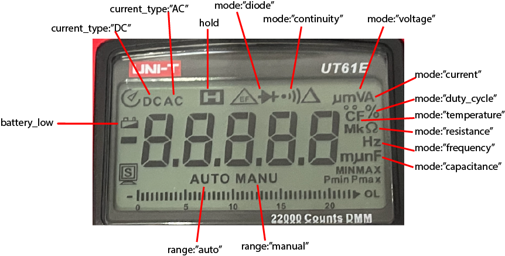

# ut61e_display decode library example - display contents

Author: @CableTie https://github.com/cabletie/UT61EWIFI

Based on code by Steffen Vogel https://github.com/stv0g/dmm_ut61e

Licenced LGPL2+

Copyright
  (C) 2013 Domas Jokubauskis (domas@jokubauskis.lt)
  (C) 2014 Philipp Klaus (philipp.l.klaus@web.de)

## Synopsys
Extracts display data from ut61e packet suitable for re-displaying in synthesised display.

Fields are directly accessible and are overwritten when parse() is called.

## values and display
There are three representations of value: `value`, `display_value`, `display_string` and `display_digits`. Why three? These are meant to provide the best selection for the client implementor to select the easiest representation to use while ensuring the full information available from the DMM is not lost.
### value: number
 Floating point actual value of reading. No multipliers. eg 1.050 kΩ is represented as 1050 and 4.234 MΩ is represented as 4234000.
### display_value: number
 This is the numeric value representing what's displayed on the display. It is not the numeric value of the measurement (use `value` for that.) So if the DMM is showing 4.234 MΩ, this value is 4.234
### display_string: string
 This is the string representation of the `display_value`. It does not contain any leading zeroes or spaces. The formatting and alignment is left to the user. if the display shows '  2.34' two leading spaces, or right aligned), this string is "2.34". ' OL.  ' is represented as "0L." and ' UL.  ' is resresented as "UL."
### display_digits: string
 This is the string representation of the display (same as `display_string`) but including any leading or trailing spaces. If the display shows '  2.34', this sytring contains '  2.34'. This provides alignment as represented on the display (usually right aligned). ' OL.  ' is represented as " OL.  " and ' UL.  ' is resresented as " UL.  "
### unit: string
 One of "V","A","Ω","Hz","F","deg" or "%" with no multiplier prefix
### display_unit: string
 One of V,A,Ω,Hz,F,deg,% with multiplier prefix as a string such as M,k,m,u,n e.g "nF", "kHz", "MΩ"
### mode: string
 Function selector mode. One of "voltage", "current", "resistance", "continuity", "diode", "frequency", "capacitance", "duty_cycle" or "temperature". These represent the major measurement modes. The diagram illustrates which annunciators are illuminated for which mode.

 
### currentType: string
 "AC" or "DC"
### peak: string
 Peak measurement mode one of "", "Pmin" or "Pmax". Data alternates between Pmax and Pmin but the DMM displays only one, alternating when multiple presses of the "PEAK" button are made.
### relative: boolean
 In relative mode `true` or `false`. True when `REL△` button is pushed but data contains current actual measurement, not the relative value.
### hold: boolean
 In hold mode `true` or `false`. When hold mode is on, the data continues to reflect what is being measured, not the `held` value.
### range: string
 Range operation "manual" or "auto"
### operation: string
 "Normal", "overload" or "underload"
### battery_low: boolean
 `true` or `false`.