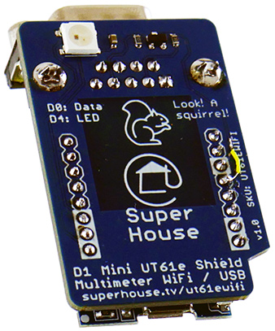

UNI-T UT61E Multimeter WiFi Interface
=====================================

The UNI-T UT61E multimeter has an opto-isolated output port that
streams data, including the currently selected range and reading.

This project is a WiFi adapter that attaches to the output port
and reports the data via WiFi or USB.

The example firmware reads the data packet from the multimeter and
publishes it to an MQTT broker, and also outputs it via the USB
port at 115200bps.



NOTE: The Rx data pin has been changed from D0 (GPIO16) in the
v1.0 design to D5 (GPIO14) in v1.1. Photos show a v1.0 PCB that
has been patched to the new Rx data pin.

More details:

  http://www.superhouse.tv/ut61ewifi


Clients
--------
To build the app locally, you can run ```bash ./Clients/build/build.sh``` from the ```/``` (root) of this repo.  
It will run a build of all the clients. (*nodeJS v16 and bash are required*)


Hardware
--------
The "Hardware" directory contains the PCB design as an EAGLE project.
EAGLE PCB design software is available from Autodesk free for
non-commercial use.


Firmware
--------
The "Firmware" directory contains example firmware as an Arduino
project.


Credits
-------
  * Jonathan Oxer <jon@oxer.com.au>
  * CableTie <https://github.com/cabletie>
  * Aaron Knox <aaron@makerdock.io>
  * Mitchell Robert <https://github.com/mrinc>


License
-------
Copyright 2021 SuperHouse Automation Pty Ltd  www.superhouse.tv  

The hardware portion of this project is licensed under the TAPR Open
Hardware License (www.tapr.org/OHL). The "license" folder within this
repository contains a copy of this license in plain text format.

The software portion of this project is licensed under the Simplified
BSD License. The "licence" folder within this project contains a
copy of this license in plain text format.

The UNI-T logo is the trademark of Uni-Trend Technology (China) Co., Ltd.
